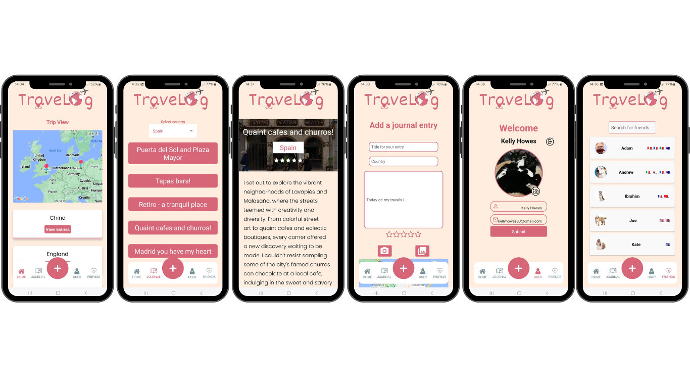

## Summary
Travelog is a nifty travel companion for jotting down memories, and keeping a personal journal of your travels.

This was created as part of the Northcoders software engineering course final project phase

The group who were named the **Algorithm Avengers** consisted of:
<br>

**Andrew Ward-Jones** - https://github.com/Koalaphant
<br><br>
**Kelly Howes** - https://github.com/KelH83
<br><br>
**Joe McCarney** - https://github.com/jmaccs
<br><br>
**Ibrahim Ullah** - https://github.com/Mullah98
<br><br>
**Adam Roberts** - https://github.com/aadamr0
<br><br>
**Kate Cory-Wright** - https://github.com/KateCory

## Tech Stack
- Frontend: React Native
- Backend: Firebase
- Additional Tools: Expo go

## Main Features
- **User Authentication**: Sign up and log in to your Travelog account.
- **User Profile**: Once logged in they can change their display name, email address and profile photo(either from their phone storage or take a new photo using the phone's camera)
- **Home screen**: Users can interact with a map that will display pins of all of their previous journal entries which are also clickable links to that entry. They will also see a list of all of the countries they have been to which are clickable and will take them to a list of all of the entries available for that country.
- **Journal Entries**: Users can see an individual entry to read the journal for the day and see any associated images
- **Journal Upload**: Users can upload a new entry including rating what they did/saw that day, add an image(from phone storage or take a new photo) and current location using the map function
- **Friends list**: Users can see a list of friends they have added on the app


## Running the Project Locally 

1. **Clone the repository:**
   ```
   git clone https://github.com/Koalaphant/TravelJournal.git

2. **Install the dependencies**
```npm install
npm init -y
npm install expo@50.0.14
npx expo install react-native-web react-dom @expo/metro-runtime
npm install firebase
```

3. **Start the development environment**
```
npx expo start
```
Follow the instructions in the terminal to open the project in your preferred development environment or device simulator.


